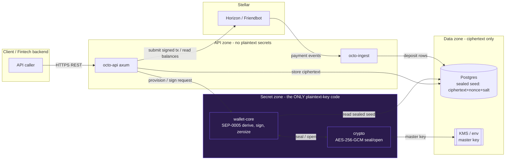
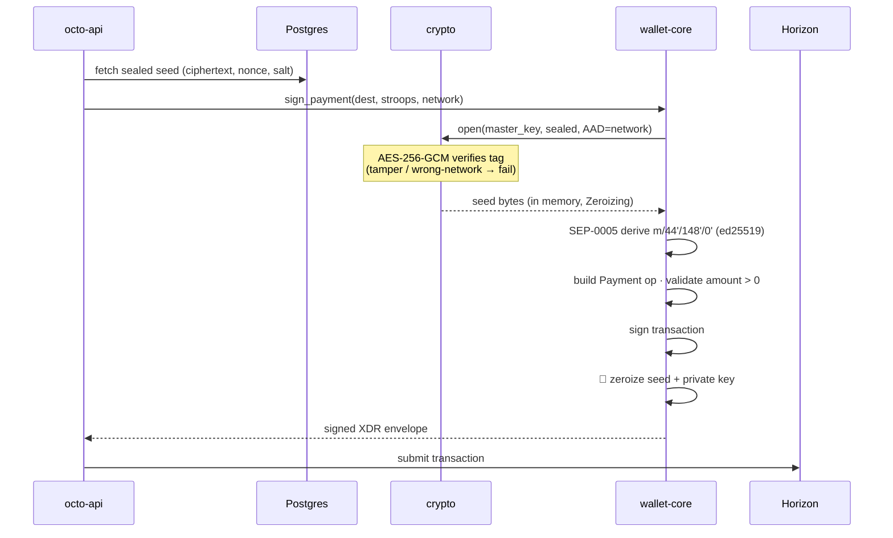

<div align="center">


# octo

**Stellar-native master-wallet infrastructure** — Wallet-as-a-Service for stablecoins.

[](https://github.com/Octo-Protocol-org/Octo-Protocol/actions/workflows/ci.yml)
[](./LICENSE)

</div>

octo lets a fintech manage stablecoin deposits on Stellar from a **single master wallet**:
generate a dedicated deposit address per customer, detect deposits in real time, and initiate
withdrawals — all behind a REST API with signed webhooks, and a non-custodial key model.

It replicates the "master wallet" backbone of platforms like Blockradar, but built **Stellar-first**.

## Why this is simple on Stellar: muxed accounts

Instead of deploying a funded on-chain account per customer (and sweeping funds back), octo
uses **muxed accounts** (`M...`): one real account (`G...`) plus a per-customer 64-bit id encoded
into the address. Deposits to a customer's `M...` land directly in the master account and carry
the id, so:

- **no auto-sweep** — funds are already in the master,
- **no per-user XLM reserve** — only one account exists on-chain,
- **generating an address is free and off-chain** — just assign the next id.

For senders that don't yet accept `M...` (e.g. some exchanges), octo also exposes the
equivalent **`G...` + numeric memo** form, and attributes deposits by **muxed id _or_ memo id**.
See [docs/deposit-model.md](docs/deposit-model.md).

## Architecture

A Cargo workspace; all secret-handling is isolated in `wallet-core` and zeroized after signing.

| Crate | Responsibility |
|---|---|
| [`crates/crypto`](crates/crypto) | AES-256-GCM seal/open of the HD seed (random nonce + salt) |
| [`crates/wallet-core`](crates/wallet-core) | SEP-0005 ed25519 derivation, muxed encode/decode, tx sign + `zeroize` |
| [`crates/store`](crates/store) | Postgres models + migrations (sqlx) |
| [`crates/webhooks`](crates/webhooks) | HMAC-SHA256 signed outbound webhooks + delivery log |
| [`crates/ingest`](crates/ingest) | Horizon payment streaming + durable cursor → deposit detection |
| [`crates/api`](crates/api) | axum REST API |
| [`bin/server`](bin/server) | composes `api` + `ingest` into one service |

See [docs/architecture.md](docs/architecture.md).

## Quickstart

```bash
# 1. Tooling: Rust 1.84.1 (pinned via rust-toolchain.toml), Docker, just
cp .env.example .env                 # then fill MASTER_KEY (openssl rand -base64 32)

# 2. Local Postgres
docker compose up -d db

# 3. Build & test
just build
just test

# 4. Run the service (REST API + deposit ingest worker)
just run            # cargo run -p octo-server  → API on $BIND_ADDR (default :8080)
```

Then, against a running server (testnet):

```bash
# Create a master wallet (friendbot-funds it on testnet)
curl -s -X POST localhost:8080/v1/wallets | jq

# Generate a customer deposit address (returns the M... and the G...+memo fallback)
curl -s -X POST localhost:8080/v1/wallets/<WALLET_ID>/addresses | jq

# Live on-chain balances
curl -s localhost:8080/v1/wallets/<WALLET_ID>/balances | jq

# Register a webhook, then withdraw (Idempotency-Key prevents double-spend)
curl -s -X POST localhost:8080/v1/wallets/<WALLET_ID>/webhooks \
  -H 'content-type: application/json' -d '{"url":"https://your.app/hooks"}' | jq
curl -s -X POST localhost:8080/v1/wallets/<WALLET_ID>/withdraw \
  -H 'content-type: application/json' -H 'Idempotency-Key: abc-123' \
  -d '{"destination":"G...DEST","amount_stroops":10000000}' | jq
```

## Security architecture

octo is custodial signing software, not a smart-contract system — so the classic web3 exploit
classes (reentrancy, flash loans, bridges, approval phishing) do not apply. The real surface is
**key custody and the signing path**, and the whole design is built around one rule: *the seed is
encrypted at rest and only ever decrypted in memory, inside one crate, for the instant it takes to
sign — then wiped.*

### Trust boundaries — where secrets live

Everything that can touch plaintext key material is confined to the **secret zone**
(`wallet-core` + `crypto`). The HTTP layer, database, and network never see a decrypted seed or a
private key.



### The signing path (per transaction)

A private key exists only inside this sequence and is zeroized before the function returns. octo
only ever builds **its own Payment operations** — it never signs caller-supplied raw XDR, so it
can't be used as a "sign anything" oracle.



### Defense summary

| Attack class | Defense in octo |
|---|---|
| Seed stolen from DB / backup | Stored **AES-256-GCM** (random nonce+salt); master key from **KMS/env**, never in the DB |
| Seed/key leaked via logs or panic | Secrets confined to `wallet-core`/`crypto`, wrapped in `Zeroizing`, no `Debug`; `unwrap`/`panic` **denied** by clippy there |
| Signing-oracle abuse | Only octo's own **Payment** ops are built; no raw-XDR signing; op-type allowlist |
| Deposit double-credit (reorg/replay) | Credited only on `successful==true`, **idempotent** on the immutable `(tx_hash, op_index)` unique index |
| Double-withdraw | **Idempotency key** + state machine; row-locked balance checks |
| Wrong-network signature | Network bound as **AES-GCM AAD** — a testnet-sealed seed can't be opened as mainnet |
| SQL injection | Parameterized `sqlx` only |
| Supply chain | `cargo-deny` + `cargo-audit` + `gitleaks` + pinned `Cargo.lock` in CI |

Full mapping in **[docs/threat-model.md](docs/threat-model.md)**. Amounts are integer **stroops**
end-to-end (never floats). Report vulnerabilities per **[SECURITY.md](SECURITY.md)** — **do not**
open public issues for security reports.

## Roadmap

- **Gas sponsorship** *(coming soon)* — let app developers sponsor their users'
  Stellar transactions from their master wallet (fee-bump / sponsored reserves), so users can
  transact without holding XLM for fees.
- MPC/HSM custody upgrade, fiat on/off-ramp, and additional chains.

## Status

Early development — built step by step. See the workspace crates for what's implemented.

## License

MIT — see [LICENSE](LICENSE).
